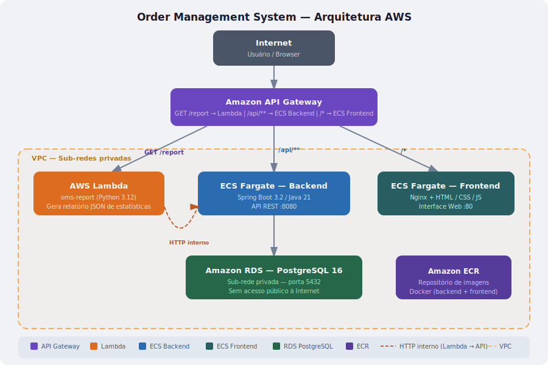

# Order Management System (OMS)

Sistema de gestão de pedidos cloud-native na AWS.

## Diagrama da Arquitetura



> Fluxo: **Internet → API Gateway → Lambda** (rota `/report`) ou **→ ECS Fargate Backend** (rotas `/api/**`) ou **→ ECS Fargate Frontend** (interface web). O backend se conecta ao **RDS PostgreSQL** em sub-rede privada.

## Stack

| Camada      | Tecnologia                        |
|-------------|-----------------------------------|
| Backend     | Java 21 + Spring Boot 3.2         |
| Frontend    | HTML / CSS / JavaScript (Nginx)   |
| Banco       | PostgreSQL 16 (Amazon RDS)        |
| Lambda      | Python 3.12 (sem dependências externas) |
| Contêineres | Docker + ECS Fargate              |
| Gateway     | Amazon API Gateway                |

## Rotas da API Gateway

| Método | Rota                        | Destino                   |
|--------|-----------------------------|---------------------------|
| GET    | `/report`                   | Lambda `oms-report`       |
| ANY    | `/api/customers/{proxy+}`   | ECS Fargate (backend)     |
| ANY    | `/api/orders/{proxy+}`      | ECS Fargate (backend)     |
| GET    | `/api/dashboard/stats`      | ECS Fargate (backend)     |
| ANY    | `/{proxy+}`                 | ECS Fargate (frontend)    |

## Endpoints CRUD

### Clientes (`/api/customers`)
| Método   | Rota                  | Descrição                |
|----------|-----------------------|--------------------------|
| GET      | `/api/customers`      | Listar todos             |
| GET      | `/api/customers/{id}` | Buscar por ID            |
| POST     | `/api/customers`      | Criar cliente            |
| PUT      | `/api/customers/{id}` | Atualizar cliente        |
| DELETE   | `/api/customers/{id}` | Remover cliente          |

### Pedidos (`/api/orders`)
| Método   | Rota                              | Descrição              |
|----------|-----------------------------------|------------------------|
| GET      | `/api/orders`                     | Listar todos           |
| GET      | `/api/orders/{id}`                | Buscar por ID          |
| POST     | `/api/orders`                     | Criar pedido           |
| PUT      | `/api/orders/{id}/status`         | Atualizar status       |
| POST     | `/api/orders/{id}/items`          | Adicionar item         |
| DELETE   | `/api/orders/{id}/items/{itemId}` | Remover item           |
| DELETE   | `/api/orders/{id}`                | Remover pedido         |

## Desenvolvimento local

### Pré-requisitos
- Docker Desktop

### Subir tudo com Docker Compose

```bash
cd infra
docker-compose up --build
```

Acesse `http://localhost` no browser.  
A API REST fica em `http://localhost:8080/api`.

O script `infra/sql/init.sql` é executado automaticamente na primeira vez que o container do banco sobe.

### Testar a Lambda localmente

```bash
cd lambda/report
API_BASE_URL=http://localhost:8080 python handler.py
```

## Deploy na AWS

### 1. Build e push das imagens Docker

```bash
# backend
cd backend
docker build -t oms-backend .
docker tag oms-backend:latest <ACCOUNT_ID>.dkr.ecr.<REGION>.amazonaws.com/oms-backend:latest
docker push <ACCOUNT_ID>.dkr.ecr.<REGION>.amazonaws.com/oms-backend:latest

# frontend
cd ../frontend
docker build -t oms-frontend .
docker tag oms-frontend:latest <ACCOUNT_ID>.dkr.ecr.<REGION>.amazonaws.com/oms-frontend:latest
docker push <ACCOUNT_ID>.dkr.ecr.<REGION>.amazonaws.com/oms-frontend:latest
```

### 2. Criar banco de dados no RDS

1. Criar instância **PostgreSQL 16** no RDS em **sub-rede privada** (sem acesso público).
2. Executar o script de inicialização:

```bash
psql -h <RDS_ENDPOINT> -U omsuser -d omsdb -f infra/sql/init.sql
```

### 3. Registrar a task definition no ECS

```bash
aws ecs register-task-definition \
  --cli-input-json file://infra/ecs-task-definition.json
```

Substitua os placeholders `<ACCOUNT_ID>`, `<REGION>`, `<RDS_ENDPOINT>` e `<CHANGE_ME>` antes de registrar.

### 4. Deploy da Lambda

```bash
cd lambda/report
zip function.zip handler.py
aws lambda create-function \
  --function-name oms-report \
  --runtime python3.12 \
  --role arn:aws:iam::<ACCOUNT_ID>:role/lambda-execution-role \
  --handler handler.lambda_handler \
  --zip-file fileb://function.zip \
  --environment Variables={API_BASE_URL=http://<ECS_ALB_DNS>}
```

### 5. Configurar API Gateway

Crie um **REST API** no API Gateway com as seguintes integrações:

| Método | Rota                      | Integração          |
|--------|---------------------------|---------------------|
| GET    | `/report`                 | Lambda `oms-report` |
| ANY    | `/api/customers/{proxy+}` | HTTP Proxy → ALB    |
| ANY    | `/api/orders/{proxy+}`    | HTTP Proxy → ALB    |
| GET    | `/api/dashboard/stats`    | HTTP Proxy → ALB    |
| ANY    | `/{proxy+}`               | HTTP Proxy → ALB    |

## Variáveis de ambiente

| Variável       | Serviço         | Descrição                               |
|----------------|-----------------|-----------------------------------------|
| `DB_URL`       | Backend / ECS   | JDBC URL do RDS PostgreSQL              |
| `DB_USER`      | Backend / ECS   | Usuário do banco                        |
| `DB_PASSWORD`  | Backend / ECS   | Senha do banco                          |
| `API_BASE_URL` | Lambda          | URL base da API no ECS (via ALB)        |

## Estrutura do projeto

```
order-management-system/
├── backend/          # Spring Boot (Java 21)
├── frontend/         # HTML/CSS/JS + Nginx
├── lambda/report/    # Função Lambda (Python 3.12)
├── infra/            # docker-compose, ECS task definition, scripts SQL
│   └── sql/
│       └── init.sql  # Script de criação das tabelas
└── docs/
    └── architecture.svg  # Diagrama da arquitetura AWS
```
